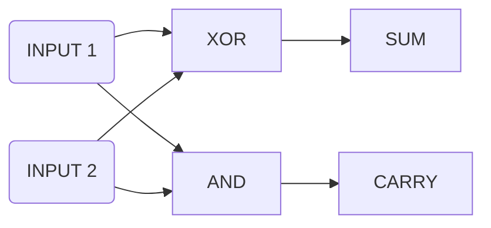
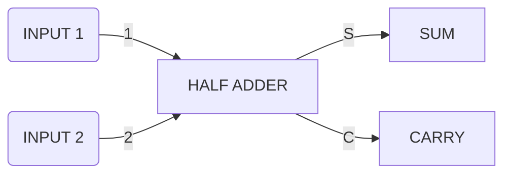
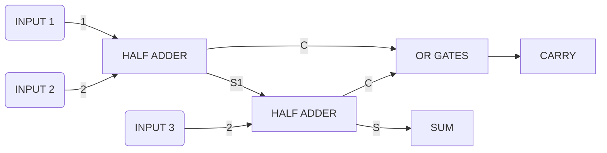
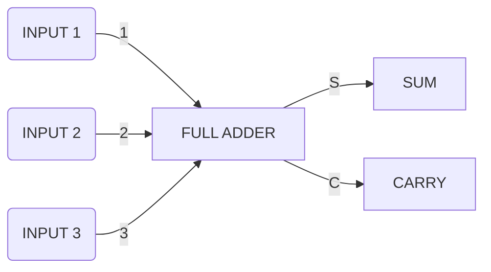
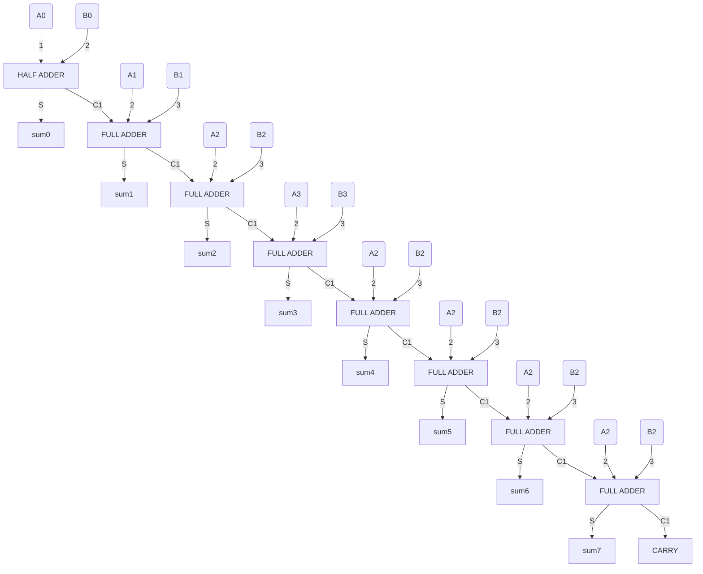
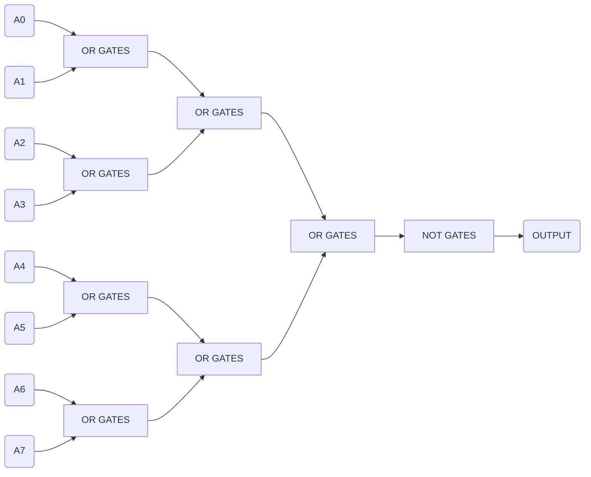
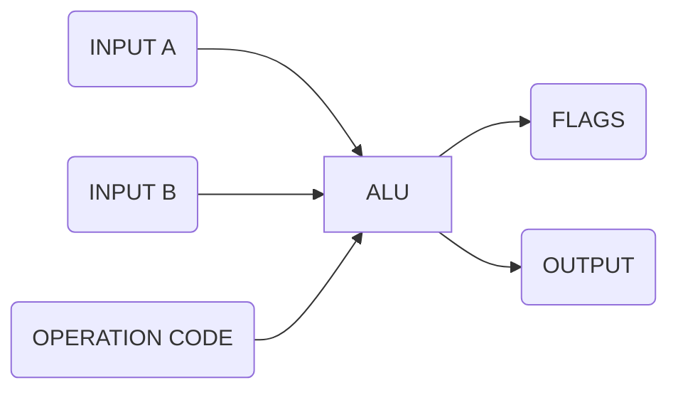

#ALU (Arithmetic Logic Unit)
Intel 74181 (the first 4-bit ALU in history)
### ALU's arithmetic unit (no Multiplication and division)

|         unit         |
| :------------------: |
|         add          |
|    add with carry    |
|       subtract       |
| subtract with borrow |
|        negate        |
|      increment       |
|      decrement       |
|     pass through     |

##### Example: 1-bit HALF ADDER ( compute the sum of  two 1-bit input)

| INPUT 1 | INPUT 2 | CARRY | SUM  |
| :-----: | :-----: | :---: | :--: |
|    0    |    0    |   0   |  0   |
|    1    |    0    |   0   |  1   |
|    0    |    1    |   0   |  1   |
|    1    |    1    |   1   |  0   |

 #####Example: 1-bit FULL ADDER (compute the sum of three 1-bit input)

| INPUT 1 | INPUT 2 | INPUT 3 | CARRY | SUM  |
| :-----: | :-----: | :-----: | :---: | :--: |
|    0    |    0    |    0    |   0   |  0   |
|    1    |    0    |    0    |   0   |  1   |
|    0    |    1    |    0    |   0   |  1   |
|    0    |    0    |    1    |   0   |  1   |
|    1    |    1    |    0    |   1   |  0   |
|    0    |    1    |    1    |   1   |  0   |
|    1    |    0    |    1    |   1   |  0   |
|    1    |    1    |    1    |   1   |  1   |

#####Example: 8-BIT RIPPLE CARRY ADDER (compute the sum of two 8-bit input)

Assume two 8-bit input A=A7 A6 A5 A4 A3 A2 A1A0 and B=B7 B6 B5 B4 B3 B2 B1B0, then this ADDER output SUM=sum7 sum6 sum5 sum4 sum3 sum2 sum1 sum0. Notice the last FULL ADDER has a CARRY output. If this output is not 0, this means the sum of A and B is too large. This is called a overflow. In general, and overflow occurs when the result of an addition is too large to be represented by the number of bits you are using. this can usually cause errors and unexpected behavior.
Modern computer dosen't use this adder anymore.
CARRY-LOOK-AHEAD ADDER (modern adding circuit)

### ALU's logic unit

##### Example:  tests if a 8-bit input is zero

### An 8-bit ALU

A and B are 8-bit inputs.

Operation code is a 4-bit input to tell ALU to do what such as add (1000) or subtract (1100).

Flags represents particular states and statuses such as overflow, zero, negative.

Output is the result of compute.

