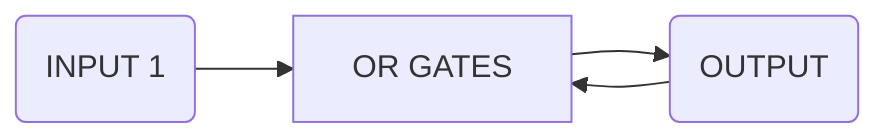
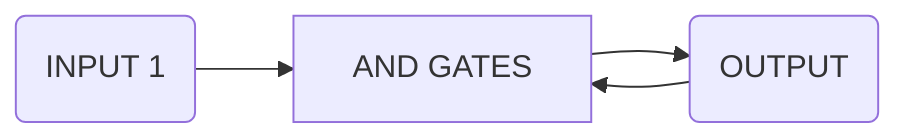
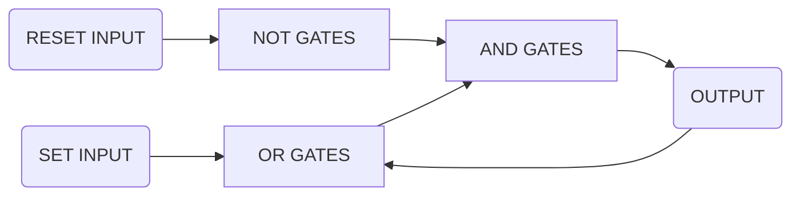
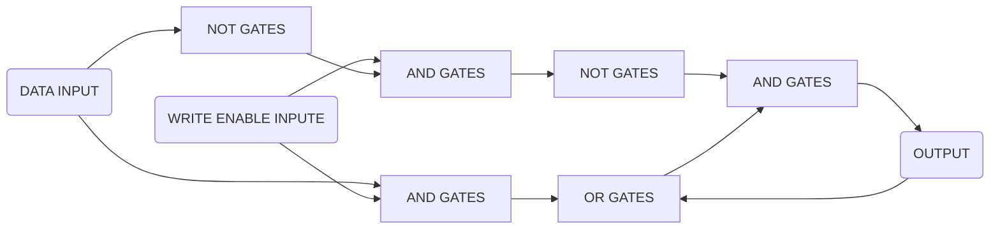
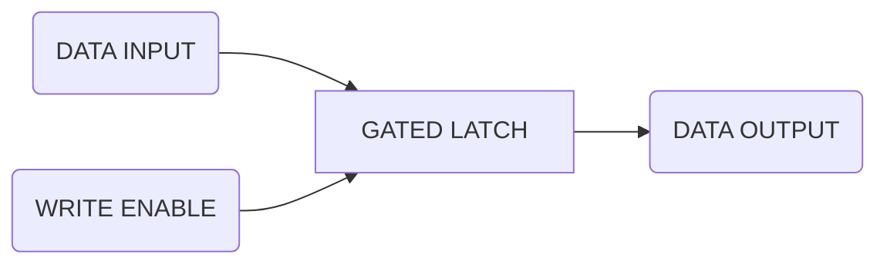
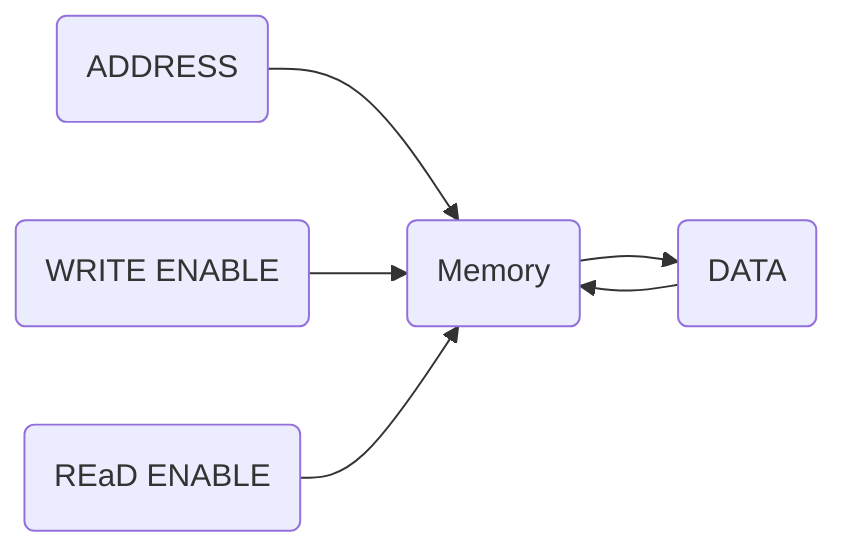
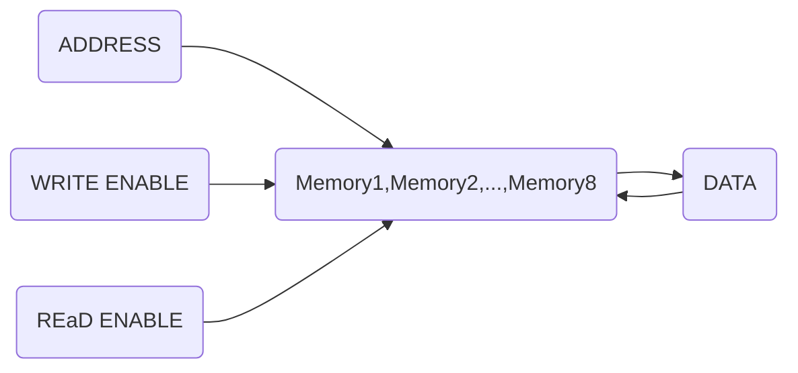

# Random Access Memory(RAM)

#####  Simple circuit that records 1

Once we input 1, then no mater what we input the output is always 1.

##### Simple circuit that records 0

Once we input 0, then no mater what we input the output is always 0.

##### AND-OR LATCH

It has two inputs, a "set" input, which sets the output to 1, and a "reset" input, which reset the output to 0.

This is called a "LATCH", because it "LATCHES ONTO" a particular value and stays that way. The action of putting data into memory is called writing, whereas getting the data out is called reading.

##### GATED LATCH (storage 1-bit data)

It has two inputs, a "DATA" input, which sets the data we want to remember, and a "write enable" input, which enables the memory to either available for writing or "locked" down. It is build by adding few extra logic gates to the AND-OR LATCH circuit.

### Register

A group of latches operating like this is called a register, which hold a single number, and the number of bits in a register is called its width. The latches of a 256-bit register are arranged as a 16*16 matrix.

This 256-bit register has five inputs, a "data in" input, which sets the data we want to remember, a "write enable" input and a "read enable" input, which enables the memory to either available for writing or read, 

a "row" input and a "col" input, which enables the unique latch we want to use. And we can use the same way to read the unique latch that we want to use.

Latch addresses are stored in 8 bit number. 4-bit stores "row" address and another 4-bit stores "col" address.

##### Multiplexer(convert address into something that selects the right row and column)

It has a 8-bit input, which represent the address of a latch.

### 256-bit Memory(storage 1-bit data)

This is a 256-bit Memory, which has a 8-bit address input and three 1-bit input "Write Enable" "Read Enable" and "DATA".

### Static Random-Access Memory(storage 8-bit data)

Combine eight 256-bit Memory mentioned before, we can get a Memory that can storage 8-bit data.

It has a 8-bit address input, a 8-bit input "DATA" and two 1-bit input "Write Enable" and "Read Enable".

This is also called a Static Random-Access Memory. There are other types or RAM, such as DRAM, Flash memory, and NVRAM. These use different circuits to store the bits.