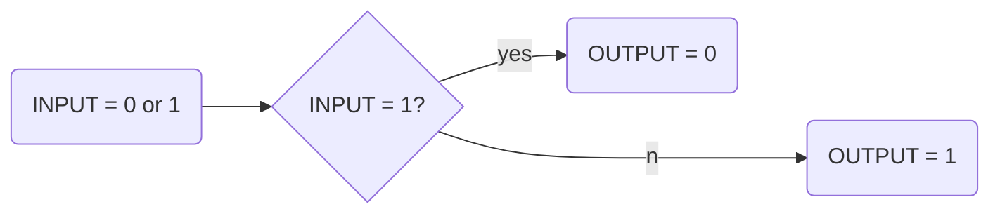
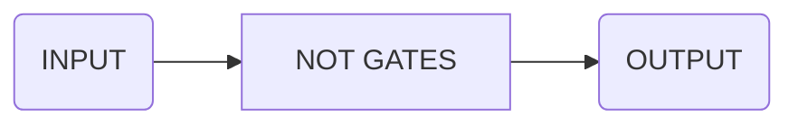
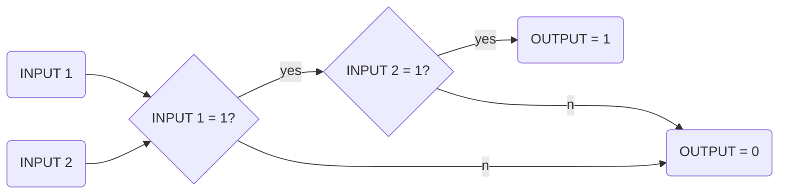
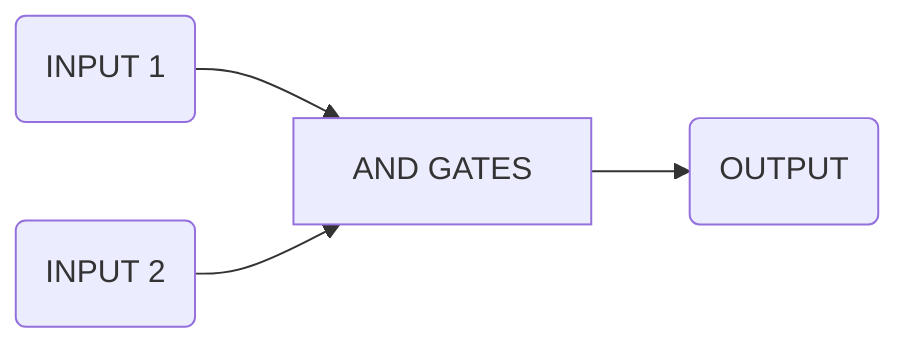
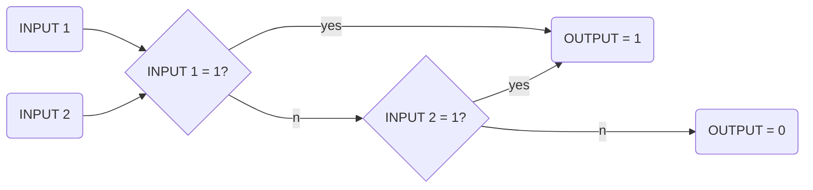
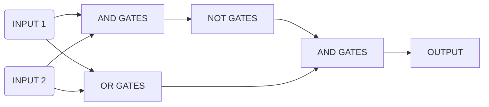
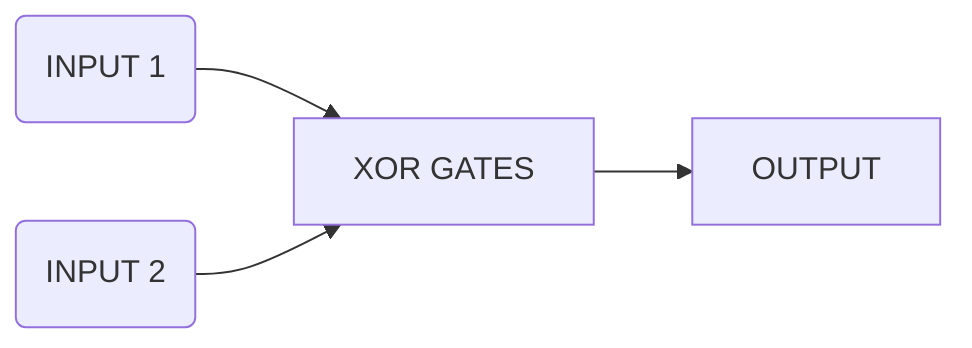

# Logic Gates

##### NOT GATES

| INPUT | OUTPUT |
| :---: | :----: |
|   0   |   1    |
|   1   |   0    |

##### AND GATES

| INPUT 1 | INPUT 2 | OUTPUT |
| :-----: | :-----: | :----: |
|    1    |    1    |   1    |
|    1    |    0    |   0    |
|    0    |    1    |   0    |
|    0    |    0    |   0    |

##### OR GATES

| INPUT 1 | INPUT 2 | OUTPUT |
| :-----: | :-----: | :----: |
|    1    |    1    |   1    |
|    1    |    0    |   1    |
|    0    |    1    |   1    |
|    0    |    0    |   0    |

##### Exclusive OR GATES (XOR GATES)

| INPUT 1 | INPUT 2 | OUTPUT |
| :-----: | :-----: | :----: |
|    1    |    1    |   0    |
|    1    |    0    |   1    |
|    0    |    1    |   1    |
|    0    |    0    |   0    |

