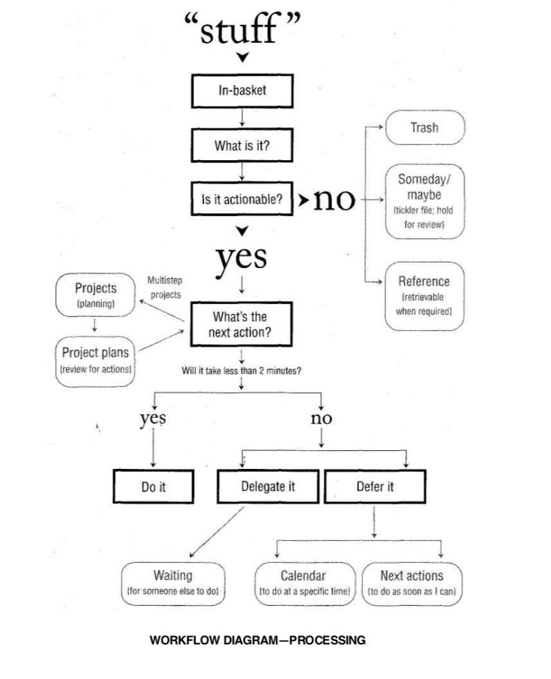

#  Getting Things Done (GTD)

### 什么是GTD

***Getting Things Done*** 是一种时间管理方法，来自David Allen的同名书籍.  通过记录的方式把头脑中的各种任务整理出来，让思路集中在当前正在完成的事情上。在事情发生之前就做好相关行动的一系列决定，组织好各种事情的提醒与下一步的行动。保持系统不断更新可靠。

GTD主要包括五步：

1. Collect: 收集你所有需要做的事情，随时将头脑中的想法记录下来，把头脑的RAM释放出来，并经常清空收集的内容；
2. Process: 判断收集的内容是否能做，将事情分类，根据两分钟原则判断是否要做，否则下一步具体计划事情；
3. Organize: 把分解细化下一步行动放到任务清单中去，形成Project或者日程；
4. Review: 定期查看和更新，保持任务是最新的（什么时候查看更新：接下来有5分钟的时间且没有更重要的事情要做；每周Review）；
5. Do: 合理选择此时此刻自己要做什么？根据情景、有多少时间、有多少精力、重要性进行选择，最后相信直觉。

两分钟原则：任何事情如果花的时间少于两分钟，那么马上就去做。两分钟是一个分水岭，这样的时间和正式地推迟一个动作所花的时间差不多。

Omnifocus是帮助实现GTD的工具，保持GTD的想法！

